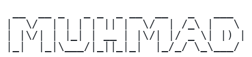

  
    
  

Most of my work lives at [sbarah.com](https://sbarah.com). Everything else here is a lab: forks, tools and half-ideas I keep around to try things and follow what is improving.

I work with AI daily and treat it as a hands-on collaborator, not a shortcut. I have done business analysis, design and development, sometimes all three on one product from first sketch to release.

## Projects

| | |
|---|---|
|  |  |
|  | |

  
    
  

