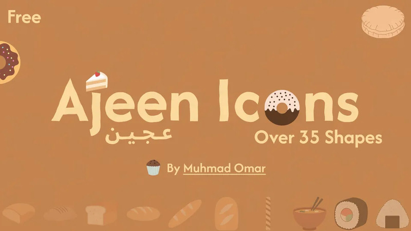

<pre>
 __  __ _   _ _   _ __  __    _    ____
|  \/  | | | | | | |  \/  |  / \  |  _ \
| |\/| | | | | |_| | |\/| | / _ \ | | | |
| |  | | |_| |  _  | |  | |/ ___ \| |_| |
|_|  |_|\___/|_| |_|_|  |_/_/   \_\____/
</pre>

 

## Projects

| | | |
|---|---|---|
|  |  |
|  |  |

